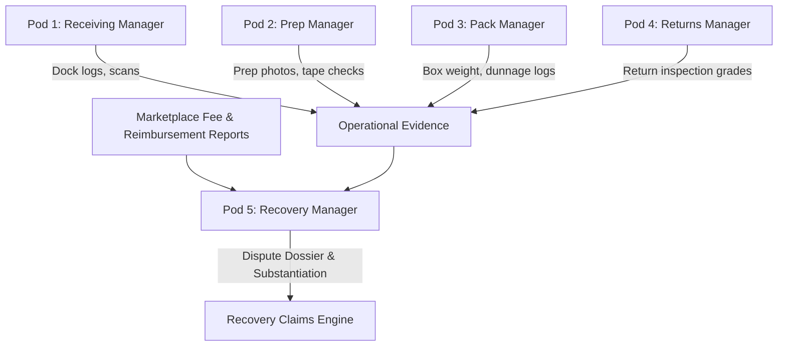
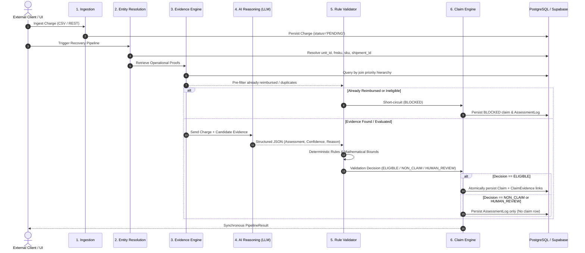
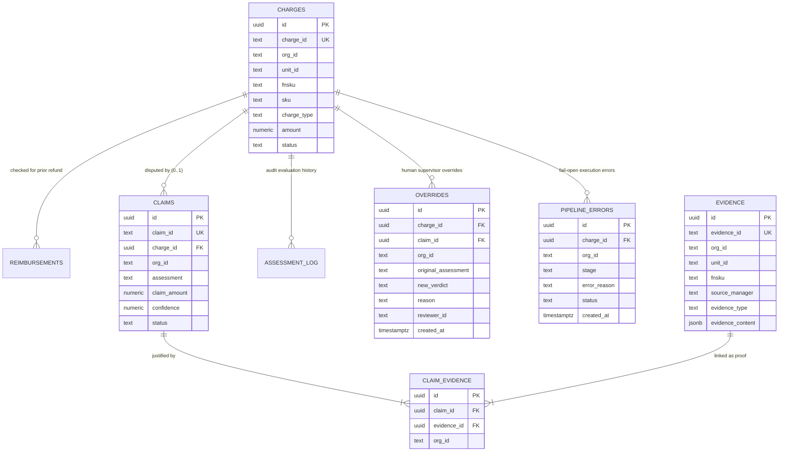

# Recovery Manager System Architecture

Comprehensive technical specification and architectural blueprint for **Recovery Manager (Pod 5 of 5)**.

---

## 1. System Purpose & 5-Pod Context

Modern e-commerce logistics operations incur significant revenue loss from automated marketplace fee deductions, inbound compliance charges (unplanned prep, carton defects, labeling penalties), and fulfillment discrepancies (weight/dimension tier overcharges).

In the 5-pod warehouse architecture:
1. **Pod 1: Receiving Manager:** Audits inbound dock intake, carton condition, and container arrival.
2. **Pod 2: Prep Manager:** Verifies and records unit preparation (polybagging, suffocation warnings, taping, barcode labels).
3. **Pod 3: Pack Manager:** Monitors outbound boxing, dunnage, package sealing, and outbound scale measurements.
4. **Pod 4: Returns Manager:** Evaluates customer returns, unit condition grading, and restocking validity.
5. **Pod 5: Recovery Manager (This System):** Ingests marketplace fee assessments and discrepancies, correlates them with physical operational evidence from Pods 1–4, and produces evidence-backed, auditable financial recovery claims.



### Guiding Architectural Principle: "Evidence First, Claim Second"
Traditional financial audit systems generate speculative claims based purely on charge codes. Recovery Manager strictly forbids this. No dispute claim is ever created unless verifiable operational evidence actively refutes the marketplace charge.

---

## 2. Recovery Pipeline Architecture

The recovery pipeline processes each charge synchronously through seven strictly segregated stages:



### Pipeline Stage Details

1. **Ingestion:**
   - Accepts CSV, XLSX, and JSON fee reports up to 10 MB.
   - Preserves complete raw row payloads in `charges.raw_data` for auditability.
   - Writes charges with `status='PENDING'`.

2. **Entity Resolution:**
   - Normalizes identifiers across heterogeneous marketplace schemas.
   - Extracts canonical identifiers: `unit_id`, `fnsku`, `sku`, `shipment_id`, `order_id`, `asin`.
   - Links charges to parent `shipments` and `orders` container entities.

3. **Evidence Retrieval:**
   - Queries `evidence` table using strict deterministic join priority:
     $$\mathbf{unit\_id} \;\longrightarrow\; \mathbf{fnsku} \;\longrightarrow\; \mathbf{sku} \;\longrightarrow\; \mathbf{shipment\_id} \;\longrightarrow\; \mathbf{order\_id} \;\longrightarrow\; \mathbf{asin}$$
   - Resolves physical records logged by Receiving, Prep, Pack, and Returns managers.

4. **Evidence Filtering:**
   - Drops irrelevant operational scans (e.g., filtering out prep records when assessing a weight tier discrepancy).
   - Deduplicates multiple scans of the same unit, maintaining chronological order and source department attribution.

5. **AI Reasoning:**
   - Evaluates whether the filtered evidence refutes the marketplace charge.
   - Returns a structured Pydantic payload containing: `assessment`, `claim_supported`, `claim_amount`, `confidence`, `reason`, `evidence_ids`.

6. **Rule Validation:**
   - Applies deterministic, non-negotiable business constraints.
   - Enforces mathematical bounds (e.g., claimed weight cannot exceed scale reading; claim amount cannot exceed charge amount).
   - Validates that `CONTRADICTED` assessments genuinely have supporting evidence attached.

7. **Claim Engine:**
   - Commits transactional records to PostgreSQL.
   - If dispute is verified: Generates unique collision-resistant `CLM-XXXXXXXX` tracking ID, records claim row, and links specific evidence via `claim_evidence` junction table.
   - If charge is legitimate (`SUPPORTED`) or no evidence exists (`SILENT`): Writes to `assessment_log` only; suppresses claim creation.
   - If conflicting logs exist (`UNCERTAIN`): Writes to `assessment_log` and routes charge to the Human Review Queue.

---

## 3. AI Boundary & Operational Controls

The system strictly constrains the role of artificial intelligence. LLMs are non-deterministic and hallucination-prone; financial recovery systems require auditable certainty.

### Explicit Permissions: What the AI Is Allowed to Do
- **Interpret Unstructured Evidence:** Analyze text descriptions, inspection check notes, and camera metadata emitted by warehouse stations.
- **Explain Discrepancies:** Formulate human-readable, grammatically coherent explanations describing how warehouse logs refute carrier fee claims.
- **Classify Outcomes:** Categorize the correlation between charge and operational evidence into one of four standard classifications:
  - `CONTRADICTED`: Operational evidence refutes the carrier claim (eligible for recovery).
  - `SUPPORTED`: Operational evidence corroborates the fee (no dispute).
  - `SILENT`: No operational records exist for this unit/event.
  - `UNCERTAIN`: Conflicting operational logs detected across stations.

### Explicit Prohibitions: What the AI Is NOT Allowed to Do
- **Invent or Extrapolate Evidence:** The AI receives a strictly bounded JSON payload of retrieved records. It cannot query external sources or assume evidence exists.
- **Bypass Database Retrieval:** The AI has no direct database access; it evaluates only the evidence passed to it by Phase 4.
- **Create or Persist Claims Directly:** The AI does not write to the database or invoke persistence methods.
- **Control Pipeline Execution:** The AI cannot alter the workflow, skip validation steps, or trigger external payouts.

> **Deterministic Gatekeeping:**  
> Claims are persisted **only after deterministic validation** by Phase 6 Rule Validator and Phase 7 Claim Engine. Even if an LLM asserts `CONTRADICTED`, the Claim Engine re-verifies mathematical boundaries, duplicate flags, and evidence existence before committing a claim row.

---

## 4. High-Level Data Model Overview

The database is built on PostgreSQL with strict referential integrity.



> For exhaustive field-level types, constraints, cascade behaviors, and indexes, refer to [database/schema.md](file:///e:/saif/projects%20made/codequest/ai%20agent/recovery-manager/database/schema.md).

---

## 5. Tenancy & Row-Level Security (RLS)

Multi-tenancy isolation is enforced at the database kernel level:

1. **`org_id` Scoping:** Every operational table contains an indexed `org_id TEXT NOT NULL` column.
2. **Forced RLS:**
   ```sql
   ALTER TABLE charges ENABLE ROW LEVEL SECURITY;
   ALTER TABLE charges FORCE ROW LEVEL SECURITY;

   CREATE POLICY org_isolation_policy ON charges
       FOR ALL
       USING (org_id = current_setting('app.current_org', true))
       WITH CHECK (org_id = current_setting('app.current_org', true));
   ```
3. **Session Context Management:**  
   The FastAPI dependency `get_db` inspects the incoming `X-Org-Id` HTTP request header and sets the session context on the checked-out connection:
   ```python
   def set_org_context(db: Session, org_id: str) -> None:
       clean_org = org_id.strip()
       db.execute(text("SET ROLE authenticated;"))
       db.execute(text("SET app.current_org = :org_id;"), {"org_id": clean_org})
   ```
4. **Superuser Testing Disclosure:**  
   Because PostgreSQL superusers (`postgres`) bypass RLS, default pytest test runs execute without RLS enforcement. Tenancy isolation is mathematically validated by running test suites under the unprivileged `authenticated` role (`verify_rls_isolation.py`), verifying that cross-tenant queries and direct primary key fetches return zero rows.

---

## 6. Fail-Open Architecture (Engineering Rule 3)

Engineering Rule 3 states:
> *"A model error or timeout still saves the capture and still produces a record, marked pending. Nothing blocks the operator. Anything that makes a warehouse line wait gets worked around within a day of deployment."*

### Implementation Mechanism
- When an unexpected LLM timeout, API rate limit (503/429), or internal exception occurs during pipeline execution, the system catches the failure gracefully.
- The pipeline writes an audit entry into the `pipeline_errors` table:
  - `charge_id`: Reference to the affected charge.
  - `stage`: Lifecycle stage that failed (`evidence_engine`, `ai_reasoning`, `claim_engine`).
  - `error_reason`: Sanitized exception summary.
  - `status`: Marked `'pending'`.
- The charge record remains in `status='PENDING'`. It is neither discarded nor stuck in an unrecoverable state.
- Operators can view pending errors and re-trigger pipeline evaluation at any time without blocking warehouse lines or operator queues.

---

## 7. Overrides-As-Data Architecture

Engineering honesty rules mandate:
> *"Overrides are data. When an operator disagrees with the agent, capture the original verdict, the new verdict and a reason. Never discard those rows silently."*

### Immutable Append-Only Ledger
When a human supervisor modifies or rejects an automated decision:
1. **Append-Only `overrides` Table:**  
   The system records the `charge_id`, `claim_id`, `original_assessment`, `original_status`, `new_verdict`, `reason`, and `reviewer_id`.
2. **Database Trigger Enforcing Immutability:**  
   A PostgreSQL trigger (`trg_prevent_overrides_mutation`) aborts any `UPDATE` or `DELETE` statement targeting the `overrides` table:
   ```sql
   CREATE OR REPLACE FUNCTION prevent_overrides_mutation()
   RETURNS TRIGGER AS $$
   BEGIN
       RAISE EXCEPTION 'Overrides are immutable audit records and cannot be updated or deleted.';
   END;
   $$ LANGUAGE plpgsql;
   ```
3. **Traceability:**  
   Historical AI assessment logs remain completely untouched in `assessment_log`. When an override creates or updates a claim, the claim explanation is appended with operator attribution, ensuring permanent traceability.

---

## 8. Evaluation & Precision-First Framework

Recovery Manager adheres to a **precision-first** assessment framework. In carrier disputes, a false claim incurs carrier penalties, administrative fines, and trust degradation. Consequently, the cost of a False Positive is significantly higher than a False Negative.

```
                  Ground Truth: ELIGIBLE         Ground Truth: NOT_ELIGIBLE
System: CLAIM       True Positive (TP)             False Positive (FP) [HIGH RISK]
System: NO CLAIM    False Negative (FN) [LOST CASH] True Negative (TN)
```

- **Target:** Maximize Precision ($\frac{TP}{TP + FP}$). Zero false positives is the primary optimization objective.
- **Conservative Default:** If dock evidence is ambiguous or incomplete, the system chooses `SILENT` or `UNCERTAIN` rather than guessing.
- **Named Failure Modes:** Every discrepancy in evaluation ledgers is tracked with an explicit classification (e.g., `conservative SILENT when evidence existed but wasn't retrieved`).
- **Dry-Run Evaluation:** Acknowledged as a local dry-run baseline on self-labeled data until the official organizer evaluation dataset is ingested.
