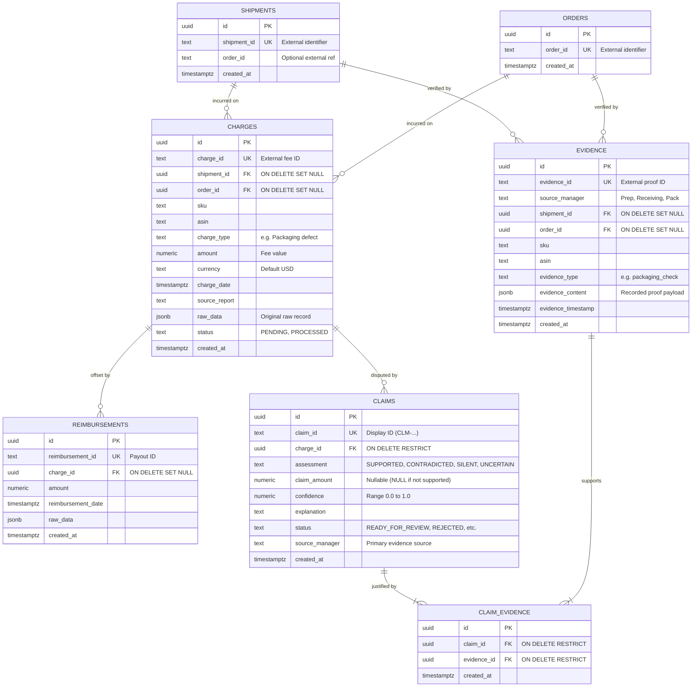

# Recovery Manager Database Schema Documentation

## Core Architectural Principle: "Evidence First, Claim Second"

Recovery Manager is engineered around the principle that **no recovery claim should exist in a vacuum**. Every claim must be strictly traceable to:
1. An imposed marketplace **charge**
2. A physical container, transaction, or product (**shipment**, **order**, **SKU**, **ASIN**)
3. Tangible, verifiable operational **evidence records** (prep scans, scale logs, packing photos, dock intake notes)
4. The operational **source manager** responsible for the evidence (e.g., `Receiving`, `Prep`, `Pack`, `Returns`)
5. High-resolution **timestamps** proving operational integrity before or during custody handoff

Crucially, **`SILENT`** (no operational proof available) and **`UNCERTAIN`** (conflicting evidence between stations) are modeled as valid, first-class decision states—not software errors or unhandled edge cases.

---

## Entity Relationship (ER) Diagram



---

## Detailed Table Specifications

### 1. `shipments`
Represents physical inbound or fulfillment shipments containing seller inventory.

| Column | Data Type | Nullable | Default | Constraints | Description |
| :--- | :--- | :--- | :--- | :--- | :--- |
| `id` | `UUID` | No | `gen_random_uuid()` | `PRIMARY KEY` | Internal synthetic primary key. |
| `shipment_id` | `TEXT` | No | *None* | `UNIQUE` | Business identifier from marketplace (e.g. `FBA17Z88Y12`). |
| `order_id` | `TEXT` | Yes | *None* | *None* | Soft reference to an associated order or shipment group. |
| `created_at` | `TIMESTAMPTZ` | No | `now()` | *None* | Record insertion timestamp. |

- **Foreign Key Behavior**: Referenced by `charges.shipment_id` and `evidence.shipment_id` (`ON DELETE SET NULL`). Deleting a shipment container record preserves charges and evidence for accounting audits.

---

### 2. `orders`
Represents external marketplace customer orders, removal orders, or transfer orders.

| Column | Data Type | Nullable | Default | Constraints | Description |
| :--- | :--- | :--- | :--- | :--- | :--- |
| `id` | `UUID` | No | `gen_random_uuid()` | `PRIMARY KEY` | Internal synthetic primary key. |
| `order_id` | `TEXT` | No | *None* | `UNIQUE` | Marketplace transaction ID (e.g. `111-2000001-0000001`). |
| `created_at` | `TIMESTAMPTZ` | No | `now()` | *None* | Record insertion timestamp. |

---

### 3. `charges`
Represents fees, surcharges, and defect penalties assessed by marketplaces or carriers.

| Column | Data Type | Nullable | Default | Constraints | Description |
| :--- | :--- | :--- | :--- | :--- | :--- |
| `id` | `UUID` | No | `gen_random_uuid()` | `PRIMARY KEY` | Internal synthetic primary key. |
| `charge_id` | `TEXT` | No | *None* | `UNIQUE` | Unique identifier from fee report / ledger. |
| `shipment_id` | `UUID` | Yes | *None* | `FK -> shipments(id)` | Associated shipment if fee occurred during inbound/transit. |
| `order_id` | `UUID` | Yes | *None* | `FK -> orders(id)` | Associated customer order if fee occurred post-sale. |
| `sku` | `TEXT` | Yes | *None* | *None* | Seller SKU subject to the charge. |
| `asin` | `TEXT` | Yes | *None* | *None* | Marketplace ASIN identifier. |
| `charge_type` | `TEXT` | No | *None* | *None* | Category of charge (e.g. `Packaging defect`, `Weight discrepancy`). |
| `amount` | `NUMERIC(12, 2)` | No | *None* | *None* | Total billed charge amount. |
| `currency` | `TEXT` | No | `'USD'` | *None* | Currency ISO code. |
| `charge_date` | `TIMESTAMPTZ` | No | *None* | *None* | Date/timestamp the marketplace imposed the charge. |
| `source_report` | `TEXT` | Yes | *None* | *None* | Filename or batch ingestion ID where charge originated. |
| `raw_data` | `JSONB` | No | `'{}'::jsonb` | *None* | Raw row payload preserved for debugging and full traceability. |
| `status` | `TEXT` | No | `'PENDING'` | *None* | Ingestion processing status (`PENDING`, `PROCESSED`, etc.). |
| `created_at` | `TIMESTAMPTZ` | No | `now()` | *None* | Record insertion timestamp. |

- **Foreign Key Behavior**:
  - `shipment_id REFERENCES shipments(id) ON DELETE SET NULL`
  - `order_id REFERENCES orders(id) ON DELETE SET NULL`
  - Referenced by `claims.charge_id` (`ON DELETE RESTRICT`) to prevent deleting disputed charges.

---

### 4. `evidence`
Verifiable operational logs, station audits, inspection photos, and scale measurements.

| Column | Data Type | Nullable | Default | Constraints | Description |
| :--- | :--- | :--- | :--- | :--- | :--- |
| `id` | `UUID` | No | `gen_random_uuid()` | `PRIMARY KEY` | Internal synthetic primary key. |
| `evidence_id` | `TEXT` | No | *None* | `UNIQUE` | Business tracking code (e.g. `EVD-PREP-8821`). |
| `source_manager` | `TEXT` | No | *None* | *None* | Operational department (e.g. `Receiving`, `Prep`, `Pack`, `Returns`). |
| `shipment_id` | `UUID` | Yes | *None* | `FK -> shipments(id)` | Shipment associated with the operational action. |
| `order_id` | `UUID` | Yes | *None* | `FK -> orders(id)` | Order associated with the operational action. |
| `sku` | `TEXT` | Yes | *None* | *None* | SKU inspected or scanned. |
| `asin` | `TEXT` | Yes | *None* | *None* | ASIN inspected or scanned. |
| `evidence_type` | `TEXT` | No | *None* | *None* | Classification (e.g. `packaging_check`, `scale_audit`). |
| `evidence_content` | `JSONB` | No | *None* | *None* | Recorded findings (e.g. `{"polybag_thickness_mil": 1.7, "photo_url": "..."}`). |
| `evidence_timestamp`| `TIMESTAMPTZ` | No | *None* | *None* | Exact time the operational inspection/scan took place. |
| `created_at` | `TIMESTAMPTZ` | No | `now()` | *None* | Record insertion timestamp. |

- **Foreign Key Behavior**:
  - `shipment_id REFERENCES shipments(id) ON DELETE SET NULL`
  - `order_id REFERENCES orders(id) ON DELETE SET NULL`
  - Referenced by `claim_evidence.evidence_id` (`ON DELETE RESTRICT`) to guarantee evidence cannot be purged while attached to a claim.

---

### 5. `reimbursements`
Existing refunds, concessions, or credits issued by the marketplace.

| Column | Data Type | Nullable | Default | Constraints | Description |
| :--- | :--- | :--- | :--- | :--- | :--- |
| `id` | `UUID` | No | `gen_random_uuid()` | `PRIMARY KEY` | Internal synthetic primary key. |
| `reimbursement_id` | `TEXT` | No | *None* | `UNIQUE` | Marketplace transaction ID for the refund. |
| `charge_id` | `UUID` | Yes | *None* | `FK -> charges(id)` | Matched charge if reconciled (`ON DELETE SET NULL`). |
| `amount` | `NUMERIC(12, 2)` | No | *None* | *None* | Amount credited or reimbursed. |
| `reimbursement_date`| `TIMESTAMPTZ` | No | *None* | *None* | Date/timestamp the reimbursement was issued. |
| `raw_data` | `JSONB` | No | `'{}'::jsonb` | *None* | Raw report record. |
| `created_at` | `TIMESTAMPTZ` | No | `now()` | *None* | Record insertion timestamp. |

---

### 6. `claims`
Dispute claims generated after comparing charges against available operational evidence.

| Column | Data Type | Nullable | Default | Constraints | Description |
| :--- | :--- | :--- | :--- | :--- | :--- |
| `id` | `UUID` | No | `gen_random_uuid()` | `PRIMARY KEY` | Internal synthetic primary key. |
| `claim_id` | `TEXT` | No | *None* | `UNIQUE` | Human-readable tracking ID (e.g. `CLM-10091`). |
| `charge_id` | `UUID` | No | *None* | `FK -> charges(id)` | Charge under review (`ON DELETE RESTRICT`). |
| `assessment` | `TEXT` | No | *None* | `CHECK (assessment IN ('CONTRADICTED', 'SUPPORTED', 'SILENT', 'UNCERTAIN'))` | Recovery engine decision. |
| `claim_amount` | `NUMERIC(12, 2)` | Yes | *None* | *None* | Dollar amount claimed (must be `NULL` for `SILENT` or `CONTRADICTED`). |
| `confidence` | `NUMERIC(5, 4)` | Yes | *None* | `CHECK (confidence >= 0 AND confidence <= 1)` | Algorithmic confidence score (0.0000 to 1.0000). |
| `explanation` | `TEXT` | Yes | *None* | *None* | Plain-English rationale detailing why the claim was generated or withheld. |
| `status` | `TEXT` | No | `'READY_FOR_REVIEW'` | *None* | Lifecycle status (`READY_FOR_REVIEW`, `DUPLICATE`, `ALREADY_REIMBURSED`, `REJECTED`, `APPROVED`). |
| `source_manager` | `TEXT` | Yes | *None* | *None* | Primary warehouse/operations source manager (e.g. `Prep`). |
| `created_at` | `TIMESTAMPTZ` | No | `now()` | *None* | Record insertion timestamp. |

- **Integrity Rule**: `claim_amount` must not exceed the associated `charges.amount`. Validated at application layer and via dispute service before claim dispatch.
- **Assessment Decision Values**:
  - `SUPPORTED`: Operational evidence demonstrates compliance and refutes the charge. Recovery claim is generated.
  - `CONTRADICTED`: Operational evidence corroborates the charge (e.g., warehouse scale confirms package was overweight). Claim is withheld/rejected.
  - `SILENT`: No operational evidence is logged for this item or event. No claim is filed (avoids frivolous disputes).
  - `UNCERTAIN`: Conflicting operational logs exist (e.g., pack station indicates sealed, receiving indicates damaged). Flagged for human review.

---

### 7. `claim_evidence` (Join Table)
Explicit link table providing many-to-many traceability between claims and the exact evidence artifacts that support or refute them.

| Column | Data Type | Nullable | Default | Constraints | Description |
| :--- | :--- | :--- | :--- | :--- | :--- |
| `id` | `UUID` | No | `gen_random_uuid()` | `PRIMARY KEY` | Synthetic row key. |
| `claim_id` | `UUID` | No | *None* | `FK -> claims(id)` | Referenced claim (`ON DELETE RESTRICT`). |
| `evidence_id` | `UUID` | No | *None* | `FK -> evidence(id)` | Referenced evidence (`ON DELETE RESTRICT`). |
| `created_at` | `TIMESTAMPTZ` | No | `now()` | *None* | Link timestamp. |

- **Composite Constraint**: `CONSTRAINT uq_claim_evidence UNIQUE (claim_id, evidence_id)` prevents redundant linkages.

---

## Query Optimization Indexes

The following indexes are established to support high-throughput lookups by the Phase 4 evidence-matching engine:

```sql
CREATE INDEX idx_charges_shipment_id ON charges(shipment_id);
CREATE INDEX idx_charges_order_id ON charges(order_id);
CREATE INDEX idx_charges_sku ON charges(sku);

CREATE INDEX idx_evidence_shipment_id ON evidence(shipment_id);
CREATE INDEX idx_evidence_order_id ON evidence(order_id);
CREATE INDEX idx_evidence_sku ON evidence(sku);
CREATE INDEX idx_evidence_asin ON evidence(asin);

CREATE INDEX idx_claims_charge_id ON claims(charge_id);

CREATE INDEX idx_claim_evidence_claim_id ON claim_evidence(claim_id);
CREATE INDEX idx_claim_evidence_evidence_id ON claim_evidence(evidence_id);
```
